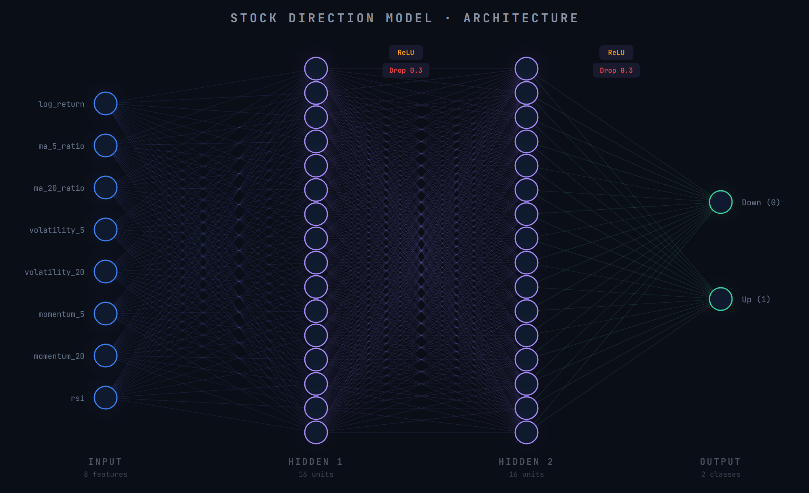

# Stock Direction Classifier
A feed forward neural network built with PyTorch that tries to predict whether Apple's (or any company's) stock prices will go up or down the next day.
> Pssst... spoiler: it does not work

## Objective
The goal of this project was to explore whether a simple deep learning model could beat random guessing at predicting daily stock direction, using only technical indicators as input features. Made for fun & giggles.

## Reproducibility
All random seeds are fixed (`torch.manual_seed`, `torch.cuda.manual_seed_all`, `np.random.seed` all set to 42, with `cudnn.deterministic = True`). Running the notebook top-to-bottom should produce similar results. Note that results may differ slightly between CPU and GPU runs, or across different versions of PyTorch.

## Dataset (customizable)
- **Source**: Yahoo finance via `yfinance`
- **Ticker**: AAPL
- **Period**: January 2010 - January 2024 (about ~3500 days)
- **Column used**: Close

## Features
| Feature | Description |
|---|---|
| `log_return` | Logarithmic daily return |
| `ma_5_ratio` | Ratio of price to its 5-day moving average |
| `ma_20_ratio` | Ratio of price to its 20-day moving average |
| `volatility_5` | Standard deviation of log returns over 5 days |
| `volatility_20` | Standard deviation of log returns over 20 days |
| `momentum_5` | Cumulative log return over 5 days |
| `momentum_20` | Cumulative log return over 20 days |
| `rsi` | Relative Strength Index (14-day window) |

The moving averages are expressed as ratios rather than raw prices, so that the values remain scale-independent across different time periods.

## Data Pipeline
1. Chronological split: 70% train / 20% validation / 10% test (no shuffling to respect time ordering).
2. StandardScaler fitted only on the training set, then applied to validation and test to prevent data leakage.
3. Conversion to PyTorch tensors and loaded into DataLoaders.

## Baseline Model Architecture

- **Loss Function**: BCEWithLogitsLoss
- **Optimizer**: Adam (lr=0.001)
- **Epochs**: 50
- **Batch size**: 32

## Hyperparameter Tuning
Some experimental models where tested, variating in hyperparameters:

| Config | Hidden units | LR | Dropout | Batch size | Val Acc |
|---|---|---|---|---|---|
| Baseline | 16 | 0.001 | 0.3 | 32 | 51.58% |
| Larger model | 64 | 0.001 | 0.3 | 32 | 50.20% |
| Lower LR | 16 | 0.0001 | 0.3 | 32 | 52.31% |
| Higher LR | 16 | 0.01 | 0.3 | 32 | 47.67% |
| Less dropout | 16 | 0.001 | 0.1 | 32 | 52.84% |
| **More dropout** | **16** | **0.001** | **0.5** | **32** | **53.88%** |
| Large batch | 16 | 0.001 | 0.3 | 128 | 52.57% |
| Best guess | 64 | 0.0001 | 0.2 | 64 | 52.44% |

## Results
- **Baseline accuracy** (predict "Up" every day): 52.87%
- **Model test accuracy:** ~49%
- **Hyperparameter tuning**: 8 configurations tested; best result (More dropout model) reached 53.88% on the validation set, barely edging the naive baseline by ~1 percentage point.
- Overall consistent with the **Efficient Market Hypothesis**: no configuration meaningfully beat random guessing.
- These can probably change a lot by running experiments with different seeds.
